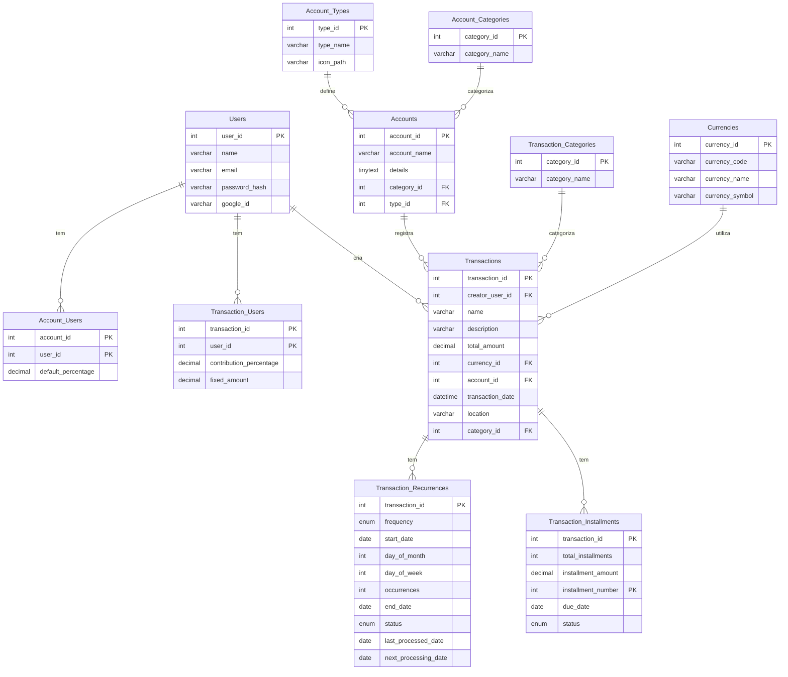
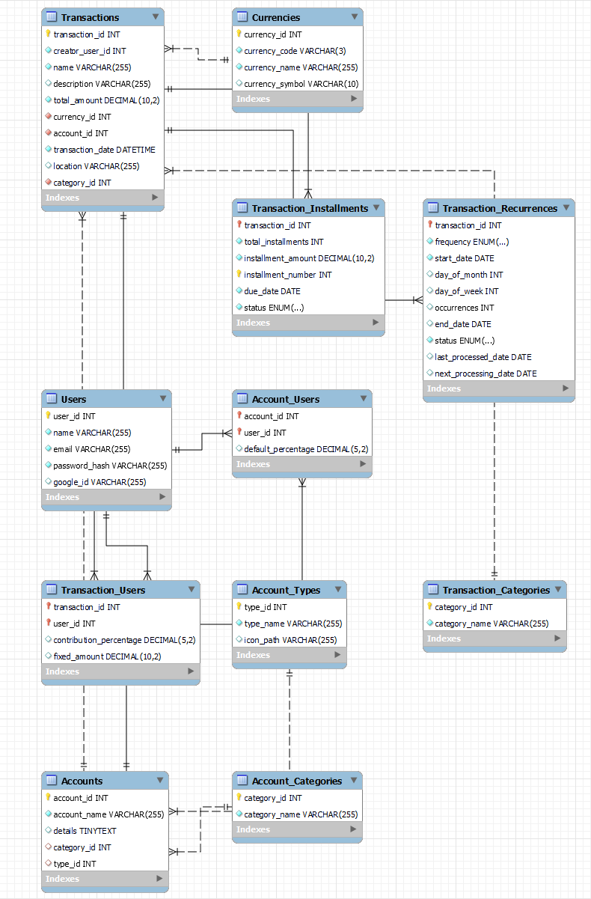

# Sistema de Gestão de Despesas Pessoais

## Descrição do Projeto
Este projeto consiste em um sistema de gestão de despesas pessoais desenvolvido como parte de um trabalho acadêmico. O sistema é projetado para auxiliar na organização e monitoramento de gastos pessoais e compartilhados, com ênfase na usabilidade e na visualização de dados financeiros.

## Entrevista com o Cliente
A concepção do sistema foi baseada em uma entrevista com a futura usuária, Letícia, que expressou a necessidade de um sistema para gerenciar despesas compartilhadas com seu parceiro, Raphael:

> **Letícia**: Oi, querido! Estive pensando... você poderia criar um sistema para nos ajudar a gerenciar nossas despesas? Seria tão melhor do que usar planilhas.
> 
> **Raphael**: Oi, querida! Que coincidência, eu estava planejando algo assim para um projeto da faculdade. Como você imagina esse sistema?
> 
> **Letícia**: Bom, seria legal se pudéssemos ter diferentes tipos de contas. Tipo, algumas para despesas domésticas, lazer, e poupança. Isso nos ajudaria a organizar melhor, não acha?
> 
> **Raphael**: Ótima ideia! Eu posso criar categorias de contas no banco de dados. E o que mais você acha que seria útil?
> 
> **Letícia**: Poderíamos categorizar nossas despesas também? Como aluguel, compras no supermercado, jantares fora... Assim fica fácil de ver para onde nosso dinheiro está indo.
> 
> **Raphael**: Com certeza! E que tal uma funcionalidade para despesas recorrentes, como o aluguel? Podemos definir isso para não esquecermos de pagar.
> 
> **Letícia**: Isso seria perfeito! E sobre as despesas compartilhadas, como vamos gerenciá-las? Seria bom ter algo que dividisse o valor entre a gente automaticamente.
> 
> **Raphael**: Boa ideia! Posso adicionar uma funcionalidade onde associamos usuários a uma transação e dividimos a despesa com base em uma porcentagem ou valor fixo.
> 
> **Letícia**: E se precisarmos rever nossos gastos por um período específico? Tipo, o quanto gastamos no último mês?
> 
> **Raphael**: Sem problemas, posso programar para gerarmos relatórios personalizados, como gastos mensais ou a comparação de diferentes categorias ao longo do tempo.
> 
> **Letícia**: Seria bom ter uma visão geral também, sabe? Quanto temos em cada conta, quanto economizamos...
> 
> **Raphael**: Claro! O sistema pode mostrar um resumo de todas as contas e os saldos. E podemos configurar metas de poupança também.
> 
> **Letícia**: Puxa vida, acho que isso vai nos ajudar bastente! Sabe, acho que isso poderia ser útil para mais pessoas. Podemos pensar em expandir isso para amigos e familiares usarem também!
> 
> **Raphael**: Ótima sugestão! Vamos trabalhar nisso. Vai ser incrível ver como isso pode ajudar não só a gente, mas também nossos amigos e familiares a gerenciar o dinheiro juntos!


## Resumo das Funcionalidades Abordadas com o Usuário

1. **Gestão de Contas Diversificadas**: Permite criar e gerenciar diferentes tipos de contas, incluindo despesas domésticas, lazer e poupança, facilitando a organização financeira.

2. **Categorização de Despesas**: Oferece a opção de categorizar despesas em múltiplos aspectos, como aluguel, compras de supermercado e saídas para jantar, proporcionando uma visão clara do fluxo financeiro.

3. **Despesas Recorrentes**: Capacidade de definir despesas recorrentes, como aluguel ou contas mensais, garantindo que pagamentos regulares sejam lembrados e gerenciados com eficácia.

4. **Gerenciamento de Despesas Compartilhadas**: Facilita o gerenciamento de despesas compartilhadas, permitindo atribuir usuários a transações específicas e dividir a despesa com base em porcentagens ou valores fixos.

5. **Relatórios Personalizados**: Possibilidade de gerar relatórios personalizados para revisão de gastos em períodos específicos, como mensal ou anual, facilitando o acompanhamento das despesas ao longo do tempo.

6. **Visão Geral Financeira**: Apresenta uma visão geral das finanças, incluindo o saldo em cada conta e o total economizado, auxiliando na tomada de decisões financeiras informadas.

7. **Metas de Poupança**: Permite configurar metas de poupança, incentivando a disciplina financeira e o planejamento a longo prazo.

8. **Expansibilidade para Amigos e Familiares**: Projetado para ser facilmente expandido e utilizado por amigos e familiares, promovendo uma gestão financeira colaborativa e eficiente.


## Modelagem do Banco de Dados
O banco de dados foi modelado utilizando Mermaid e MySQL Workbench, com foco em funcionalidades como categorização de despesas, gerenciamento de contas múltiplas e relatórios financeiros personalizados.

### Modelagem Entidade-Relacionamento



### Modelagem Relacional


## Implementação do Banco de Dados
Os scripts para a criação e configuração das tabelas do banco de dados estão disponíveis abaixo:

- [Script de Criação da Base de Dados](./db_coviver.sql)
- [Script de Inserção de Dados](./insert_fake_data.sql)

## Consultas SQL

### Relatório de Gastos por Categoria (parametrizado por `usuário`, `ano` e `mês`)

```sql
SET @userId = 1; -- Defina o ID do usuário
SET @ano = 2023; -- Defina o ano desejado
SET @mes = 2;    -- Defina o mês desejado

SELECT 
    tc.category_name, 
    SUM(CASE 
            WHEN tr.transaction_id IS NOT NULL THEN t.total_amount / COALESCE(NULLIF(tr.occurrences, 0), 1)
            WHEN ti.transaction_id IS NOT NULL THEN ti.installment_amount
            ELSE t.total_amount
        END * COALESCE(tu.contribution_percentage, au.default_percentage) / 100) AS TotalGasto
FROM `db_coviver`.`Transactions` t
LEFT JOIN `db_coviver`.`Transaction_Recurrences` tr ON t.transaction_id = tr.transaction_id
LEFT JOIN `db_coviver`.`Transaction_Installments` ti ON t.transaction_id = ti.transaction_id
LEFT JOIN `db_coviver`.`Transaction_Users` tu ON t.transaction_id = tu.transaction_id AND tu.user_id = @userId
LEFT JOIN `db_coviver`.`Account_Users` au ON t.account_id = au.account_id AND au.user_id = @userId
JOIN `db_coviver`.`Transaction_Categories` tc ON t.category_id = tc.category_id
WHERE (t.creator_user_id = @userId OR t.account_id IN (SELECT account_id FROM `db_coviver`.`Account_Users` WHERE user_id = @userId))
      AND YEAR(t.transaction_date) = @ano AND MONTH(t.transaction_date) = @mes
GROUP BY tc.category_name;

```	

### Relatório de Gasto Mensal (parametrizado por `usuário`, `ano` e `mês`)

```sql
SET @userId = 1; -- Defina o ID do usuário
SET @ano = 2023; -- Defina o ano desejado
SET @mes = 2;    -- Defina o mês desejado

SELECT 
    MONTH(t.transaction_date) AS Mês, 
    YEAR(t.transaction_date) AS Ano, 
    SUM(CASE 
            WHEN tr.transaction_id IS NOT NULL THEN t.total_amount / COALESCE(NULLIF(tr.occurrences, 0), 1)
            WHEN ti.transaction_id IS NOT NULL THEN ti.installment_amount
            ELSE t.total_amount
        END * COALESCE(tu.contribution_percentage, au.default_percentage) / 100) AS TotalGasto
FROM `db_coviver`.`Transactions` t
LEFT JOIN `db_coviver`.`Transaction_Recurrences` tr ON t.transaction_id = tr.transaction_id
LEFT JOIN `db_coviver`.`Transaction_Installments` ti ON t.transaction_id = ti.transaction_id
LEFT JOIN `db_coviver`.`Transaction_Users` tu ON t.transaction_id = tu.transaction_id AND tu.user_id = @userId
LEFT JOIN `db_coviver`.`Account_Users` au ON t.account_id = au.account_id AND au.user_id = @userId
WHERE (t.creator_user_id = @userId OR t.account_id IN (SELECT account_id FROM `db_coviver`.`Account_Users` WHERE user_id = @userId))
      AND YEAR(t.transaction_date) = @ano AND MONTH(t.transaction_date) = @mes
GROUP BY YEAR(t.transaction_date), MONTH(t.transaction_date);

```

### Relatório de Transações Compartilhadas (parametrizado por `usuário`, `ano` e `mês`)

```sql
SET @userId = 1; -- Defina o ID do usuário
SET @ano = 2023; -- Defina o ano desejado
SET @mes = 2;    -- Defina o mês desejado

SELECT 
    t.transaction_id, 
    t.name, 
    u.name AS User, 
    COALESCE(tu.contribution_percentage, au.default_percentage) AS Contribuicao, 
    (CASE 
        WHEN tr.transaction_id IS NOT NULL THEN t.total_amount / COALESCE(NULLIF(tr.occurrences, 0), 1)
        WHEN ti.transaction_id IS NOT NULL THEN ti.installment_amount
        ELSE t.total_amount
    END * COALESCE(tu.contribution_percentage, au.default_percentage) / 100) AS TotalGasto
FROM `db_coviver`.`Transactions` t
JOIN `db_coviver`.`Transaction_Users` tu ON t.transaction_id = tu.transaction_id
JOIN `db_coviver`.`Users` u ON tu.user_id = u.user_id
LEFT JOIN `db_coviver`.`Transaction_Recurrences` tr ON t.transaction_id = tr.transaction_id
LEFT JOIN `db_coviver`.`Transaction_Installments` ti ON t.transaction_id = ti.transaction_id
LEFT JOIN `db_coviver`.`Account_Users` au ON t.account_id = au.account_id AND au.user_id = @userId
WHERE (t.creator_user_id = @userId OR t.account_id IN (SELECT account_id FROM `db_coviver`.`Account_Users` WHERE user_id = @userId))
      AND YEAR(t.transaction_date) = @ano AND MONTH(t.transaction_date) = @mes;
```
### Relatório de Transações Pendentes (parametrizado por `usuário`)

```sql
SET @userId = 1; -- Defina o ID do usuário

SELECT 
    t.transaction_id,
    t.name AS NomeTransacao,
    t.total_amount AS QuantiaTotal,
    (SELECT SUM(ti.installment_amount) 
     FROM `db_coviver`.`Transaction_Installments` ti
     WHERE ti.transaction_id = t.transaction_id AND ti.status = 'Paid') AS QuantiaPaga,
    ti.installment_amount AS ValorParcela,
    (SELECT COUNT(*) 
     FROM `db_coviver`.`Transaction_Installments` ti
     WHERE ti.transaction_id = t.transaction_id) AS TotalParcelas,
    (SELECT COUNT(*) 
     FROM `db_coviver`.`Transaction_Installments` ti
     WHERE ti.transaction_id = t.transaction_id AND ti.status = 'Paid') AS ParcelasPagas
FROM `db_coviver`.`Transactions` t
JOIN `db_coviver`.`Transaction_Installments` ti ON t.transaction_id = ti.transaction_id
WHERE (t.creator_user_id = @userId OR t.account_id IN (SELECT account_id FROM `db_coviver`.`Account_Users` WHERE user_id = @userId))
      AND ti.status = 'Pending'
GROUP BY t.transaction_id, ti.installment_amount;
```